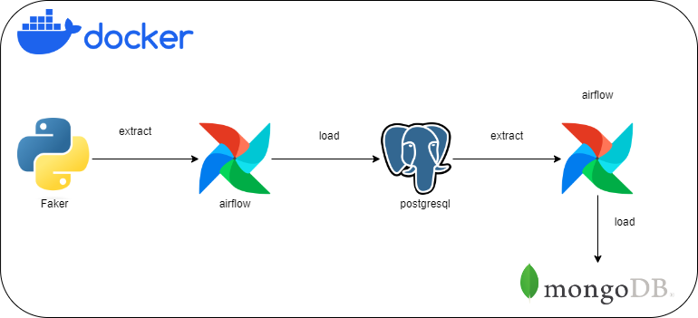

# Data Pipeline with Apache Airflow


## Description

This project implements a robust data pipeline using Apache Airflow, integrating PostgreSQL for data storage, Redis as a message broker, and MongoDB for NoSQL data handling. It's designed for scalability, efficiency, and ease of management, suitable for a wide range of data processing and ETL tasks.

## Features

- **Apache Airflow**: Orchestrates complex workflows and data processing tasks.
- **PostgreSQL**: Robust relational database for structured data storage.
- **MongoDB**: Flexible NoSQL database for unstructured data handling.
- **Docker Compose**: Simplifies deployment of multi-container applications.

## Prerequisites

- Docker and Docker Compose installed.
- Basic understanding of Python, SQL, and NoSQL databases.
- WSL2 installed

## Installation & Setup

1. **Clone the Repository**
   ```bash
   git clone [Your Repository URL]
   cd [Your Repository Name]
2. **Setup your evironement**
 
   
4.  **Build and Run with Docker Compose**
     ```bash
     docker compose up --build
This command builds the Docker images and starts the services defined in your docker-compose.yml file.


## Usage
Once the services are up and running, you can access the Airflow web interface at http://localhost:8080. Use the default credentials (if not changed) to log in:

   - **Username**: airflow
   - **Password**: airflow


## Project Structure
- ./src/airflow/dags: Airflow DAGs for workflow definitions.
- ./src/db_sql: SQL scripts and database management utilities.
- ./src/db_psql: PostgreSQL database management scripts.
- ./src/db_mongo: MongoDB initialization and management scripts.
## Contributing
Contributions to this project are welcome! Please adhere to the following guidelines:

- Fork the repository and create your branch from main.
- Write clear and concise commit messages.
- Ensure code style and quality compliance.
- Create a pull request with a detailed description of your changes.
   
